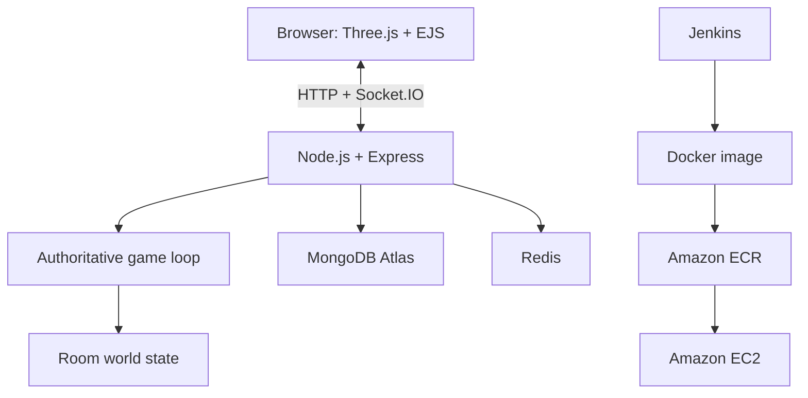

# PixelMania

**A server-authoritative 3D multiplayer arena game built with Node.js, Socket.IO, Three.js, MongoDB, and Redis.**

[](https://nodejs.org/)
[](https://expressjs.com/)
[](https://socket.io/)
[](https://threejs.org/)
[](https://www.docker.com/)
[](https://aws.amazon.com/)

PixelMania, formerly **Echoes of Oblivion**, is a browser-based multiplayer game in which the server owns the authoritative world state. Players send movement and action intent through Socket.IO, while the server calculates physics, collisions, combat, match timing, and leaderboard results.

> **Production snapshot:** The application returned HTTP 200 at `http://13.207.5.21` on July 26, 2026. Availability is not continuously guaranteed by this README.

## Highlights

- Server-authoritative multiplayer engine running at approximately 30 Hz
- Room-isolated world state with up to three players per match
- Real-time movement, combat, chat, typing indicators, and leaderboard updates
- Three.js jungle arena with procedural scenery, particles, lighting, fog, and CSS2D labels
- Player and administrator authentication using sessions, JWT, bcrypt, and email OTP
- MongoDB persistence and Redis-backed short-lived state
- Docker Compose orchestration for the application and Redis
- Jenkins pipeline that builds and publishes versioned images to Amazon ECR
- Production deployment on Amazon EC2

## Architecture



| Layer | Technology | Responsibility |
| --- | --- | --- |
| Browser | Three.js r128, Socket.IO client, EJS | Rendering, input, HUD, chat, and leaderboard |
| Application | Node.js, Express 5, Socket.IO 4 | HTTP routes, sessions, rooms, and game loop |
| State | MongoDB Atlas, Redis 7 | Persistent users/feedback and short-lived OTP state |
| Security | JWT, express-session, bcryptjs | Player and administrator authentication |
| Delivery | Jenkins, Docker, Amazon ECR | Validation, image building, tagging, and publication |
| Runtime | Amazon EC2, Docker Compose | Application and Redis containers |

## Multiplayer Engine

Each game room owns an independent `World[roomId]` state.

1. The client captures keyboard input and sends directional intent.
2. The server processes movement, gravity, and collisions on a roughly 33 ms tick.
3. The authoritative position snapshot is broadcast through `update-movement`.
4. Clients interpolate the received state to render smooth movement.

The server also owns:

- player health and lives
- projected sphere-distance collision checks
- five-minute match timing
- room-scoped chat and typing events
- heap-sorted match leaderboards
- disconnect cleanup
- duplicate-session prevention through `activeUsers`

## Browser Rendering

The client renders a jungle-themed arena using Three.js:

- fog, multiple lights, floor grid, and a glowing arena boundary
- low-poly player avatars assembled from primitives
- deterministic player colors derived from player names
- HTML name and health labels through `CSS2DObject`
- interpolated chase camera
- procedural vegetation and particle effects
- movement-based limb animation

The renderer uses a reduced pixel ratio of `0.55` to prioritize browser performance.

## Authentication and Data

### Players

- Signup and signin
- Password hashing with `bcryptjs`
- Session regeneration
- Player JWT cookie
- Multer-based avatar uploads

### Administrators

- Separate administrator JWT
- Email OTP stored in Redis
- Five-minute OTP expiry
- Three-attempt verification lockout

### Additional services

- Mongoose models for users and feedback
- Nodemailer with SendGrid SMTP for welcome and OTP messages
- OpenAI-assisted grouping and summarization of submitted feedback

## Tech Stack

| Category | Technologies |
| --- | --- |
| Backend | Node.js, Express 5 |
| Real-time | Socket.IO 4 |
| Rendering | Three.js r128, CSS2DRenderer |
| Views | EJS |
| Database | MongoDB Atlas, Mongoose |
| Cache | Redis 7, ioredis |
| Authentication | JWT, express-session, bcryptjs |
| Uploads | Multer |
| Email | Nodemailer, SendGrid SMTP |
| Infrastructure | Docker, Docker Compose, Jenkins, Amazon ECR, Amazon EC2 |

## Getting Started

### Prerequisites

- Node.js 20+
- MongoDB
- Redis
- Docker and Docker Compose, if using containers

### Clone the repository

```bash
git clone https://github.com/Aravcode2005/pixisecr.git
cd pixisecr
```

### Configure the environment

Create a `.env` file and provide the application secrets and service connections required by the source configuration, including:

- MongoDB connection URI
- Redis URL
- session and JWT secrets
- SendGrid/SMTP configuration
- OpenAI credentials, if AI feedback processing is enabled

Do not commit `.env` or production credentials.

### Run with Docker Compose

```bash
docker compose up --build
```

The Compose configuration:

- maps host port `80` to application port `8081`
- starts the application and Redis
- persists Redis data in the `redis-data` volume
- restarts services unless stopped

Open `http://localhost` after the containers become healthy.

### Run without Docker

Start MongoDB and Redis, configure `.env`, then run:

```bash
npm ci
node server.js
```

The application listens on port `8081` in the production container configuration.

## Container Design

The production image:

- uses `node:20-alpine`
- installs locked production dependencies using `npm ci --omit=dev`
- exposes port `8081`
- launches through `entrypoint.sh`

The entrypoint uses `set -e` and:

```sh
exec node server.js
```

Using `exec` makes Node.js PID 1, allowing it to receive container shutdown signals correctly.

## CI and Image Delivery

The Jenkins pipeline:

1. Checks Node.js, npm, Docker connectivity, and required environment values.
2. Installs locked dependencies with `npm ci`.
3. Runs `npx jest --passWithNoTests`.
4. Builds an image tagged with the Jenkins build number and Git commit.
5. Installs or reuses AWS CLI.
6. Inspects the built image.
7. Authenticates to Amazon ECR using Jenkins-managed credentials.
8. Pushes immutable build-numbered and mutable `latest` tags to the `piximania` repository.

> The checked-in pipeline publishes images to ECR but does not contain an automated EC2 deployment stage. EC2 rollout is currently a separate deployment step.

## Production Topology

```text
Internet :80
    |
Amazon EC2
    |
    +-- PixelMania container :8081
    |
    +-- Redis 7 container :6379
```

## Current Engineering Gaps

- Add meaningful unit, integration, and multiplayer behavior tests.
- Add automated EC2 rollout, health verification, and rollback.
- Add dedicated health and readiness endpoints.
- Introduce structured production logging and monitoring.
- Normalize package metadata that still references Echoes of Oblivion.
- Enforce player email and username uniqueness with database indexes.
- Correct simultaneous-direction handling in the client `keyup` flow.
- Keep all administrator credentials outside source control and rotate exposed secrets.
- Use a dedicated production start script instead of a nodemon-based package script.

## Roadmap

- [ ] Automated post-ECR deployment to EC2
- [ ] Container health checks and rollback
- [ ] Integration tests for authentication and room lifecycle
- [ ] Load testing for concurrent Socket.IO rooms
- [ ] Metrics for tick duration, room count, event latency, and disconnects
- [ ] Improved client-side prediction and reconciliation

## Project Evolution

| Earlier Echoes snapshot | Current PixelMania state |
| --- | --- |
| Echoes of Oblivion branding | PixelMania / PixelManiaV2 identity |
| Empty Dockerfile | Node 20 Alpine production image |
| Dependency-only Compose setup | Application and Redis orchestration |
| No application entrypoint | Signal-safe shell entrypoint |
| No verified registry workflow | Jenkins build, tagging, inspection, and ECR publishing |
| No verified public runtime | EC2 deployment verified on July 26, 2026 |

## Author

Built independently by **Arav Gupta**.

- GitHub: [@Aravcode2005](https://github.com/Aravcode2005)
- Repository: [Aravcode2005/pixisecr](https://github.com/Aravcode2005/pixisecr)

## Verification Reference

This README is based on the engineering snapshot for commit:

```text
0d1e38dc88b5b23f7142c6fb72c17439436901e9
```

Snapshot date: **July 26, 2026**
